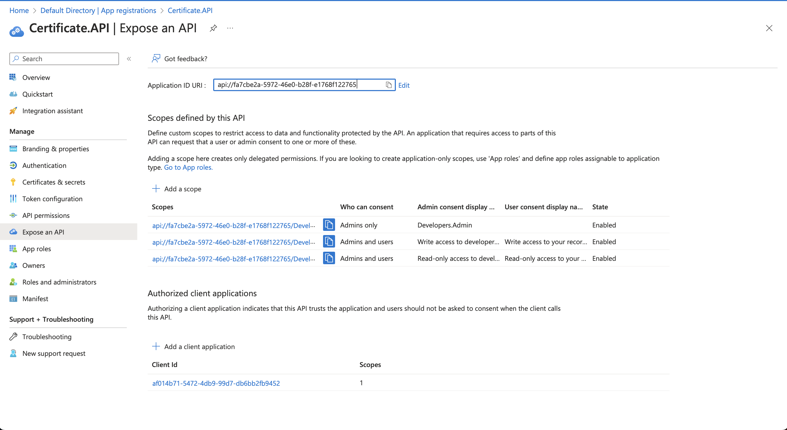
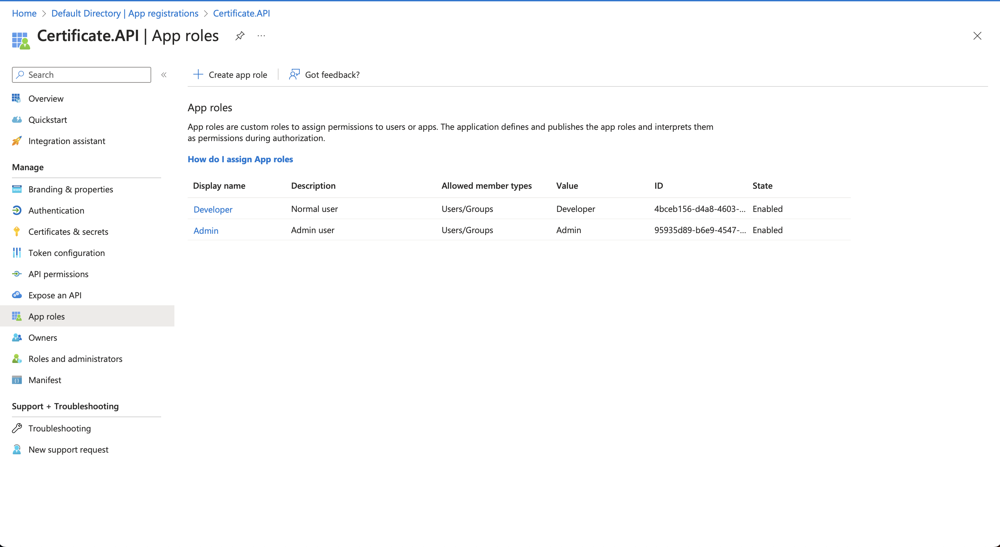
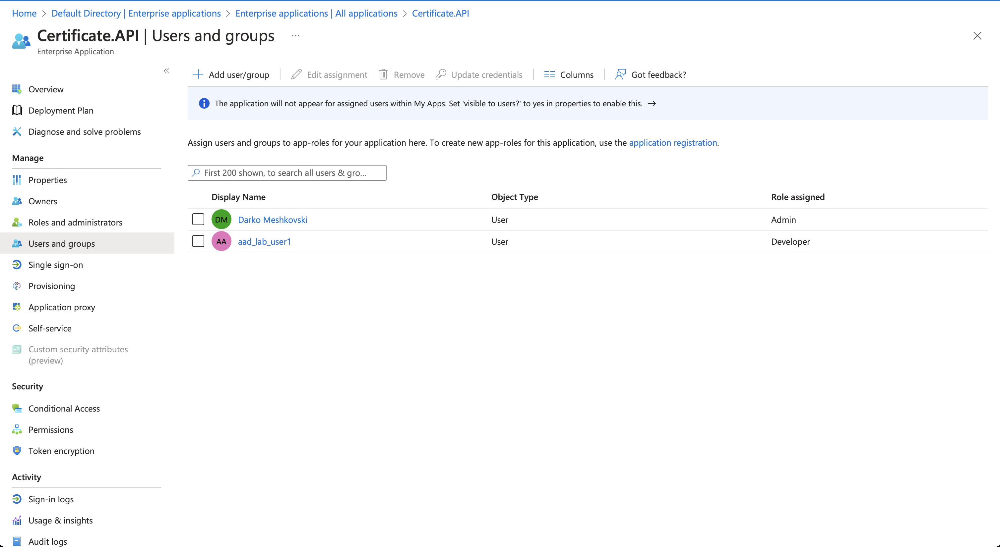
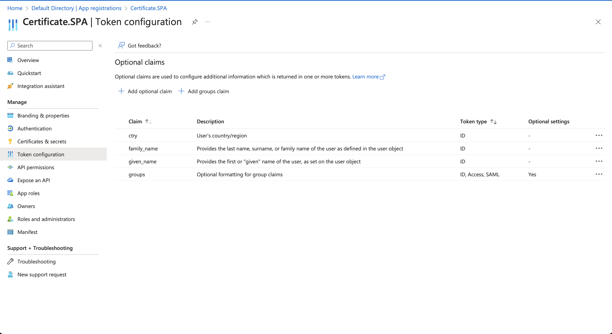
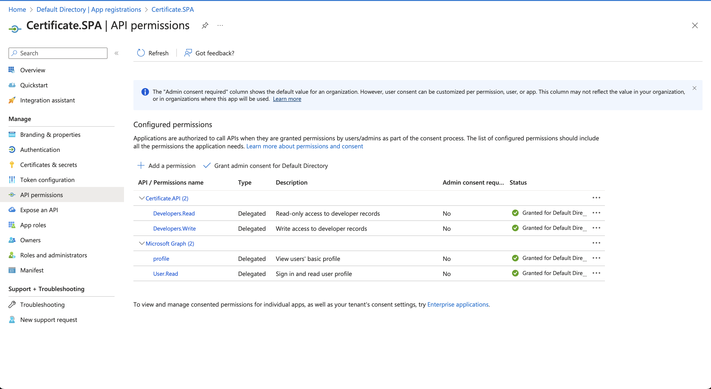

# Az204 hands-on lab

## Architecture
DIAGRAM GOES HERE

## Business requirements
- The connection string for Cosmos needs to be stored in Key Vault
- The costs for the storage account must be minimized
- The consistency level of CosmosDB is set to **Strong**, but for the following scenarios it needs to be cost-optimized to accomodate for the following scenarios:
    - Multiple writes must be allowed and the possible challenges that come with that handled
    - When the application is exporting the developer report, it needs to do it with minimal latency
    - When new developer logs are added, they need to be handled in the correct order, as they are being added
    - BLABLA
- Sign requests with a public certificate that is also stored & managed by Key Vault
- The maximum execution of the Azure Functions is 15 minutes
- The *Certificate.API* is going to authorise the user based on his roles (Developer|Admin) and the additional claims he has granted for the API (Developers.Read|Developers.Write)
- The *Certificate.SPA* application is needs to display the users full name, the groups he belongs to, and his country

---

## Solution

### 1. Upload your applications to Azure
BLABLA

---

### 2. Register your applications with Azure AD (AAD)

#### Certificate.API

#### Certificate.SPA

---

### 3. Configure your applications to authenticate & authorize with AAD

### 4. Test your applications
